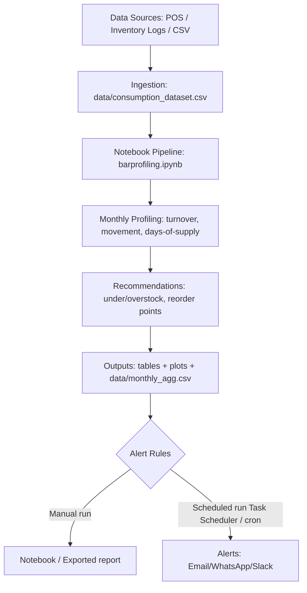
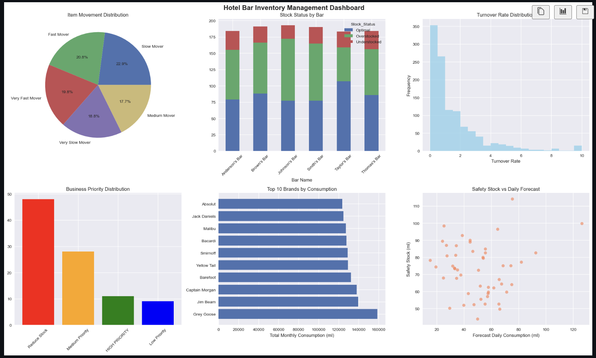

# Hotel Chain Bar Inventory Management System


> A comprehensive analytical framework for demand forecasting and inventory optimization across multiple hotel bar locations.

**Current status (what exists today):** analysis is implemented as notebooks in this folder (see [barprofiling.ipynb](barprofiling.ipynb)). Several “full system” items below are kept as a roadmap and are marked accordingly.

## 🚀 Quick Start

```bash
# From this folder in VS Code:
# 1) Ensure the dataset exists at: data/consumption_dataset.csv
# 2) Open and run: barprofiling.ipynb

# If you need packages:
pip install pandas numpy matplotlib seaborn
```
<!-- python main.py --config config/production.yaml -->

## 📋 Table of Contents

- [Overview](#overview)
- [Problem Statement](#problem-statement)
- [Features](#features)
- [Data Structure](#data-structure)
- [Installation](#installation)
- [Usage](#usage)
- [System Architecture](#system-architecture)
- [Monitoring & Alerting](#monitoring-alerting)<!--  [Contributing](#contributing) -->
- [License](#license)

## 📊 Overview

<a id="overview"></a>

The Hotel Chain Bar Inventory Management System is designed to solve critical inventory challenges faced by hospitality businesses operating multiple bar locations. The system uses advanced forecasting algorithms and optimization techniques to reduce stockouts while minimizing excess inventory.

### Key Benefits
- ⚡ **15-25% reduction** in stockout incidents
- 💰 **10-20% decrease** in excess inventory
- 📈 **5-10% improvement** in bar revenue
- 🎯 **95%+ service level** achievement

## 🎯 Problem Statement

<a id="problem-statement"></a>

### Current Challenges
- **Frequent stockouts** of high-demand items → Lost revenue & guest dissatisfaction
- **Overstocking** of slow-moving inventory → Increased carrying costs
- **Manual inventory management** → Operational inefficiency
- **Inconsistent service levels** across locations → Brand reputation risk

## ✨ Features

<a id="features"></a>

Legend:
- ✅ Implemented in notebook
- 🛠️ Planned / roadmap

### 🔮 Demand Forecasting
- ✅ Basic forecasting (moving averages + simple trend ensemble)
- 🛠️ Exponential smoothing (ETS) and more advanced time-series models
- 🛠️ Seasonality detection (weekly/monthly)
<!-- - 🛠️ Event impact modeling (holidays/special occasions) -->
<!-- - 🛠️ Location clustering for similar demand patterns -->

### 📦 Inventory Optimization
- ✅ Par level / max stock heuristics (based on movement category)
- ✅ Safety stock + reorder point calculation (based on demand variability + lead time)
- 🛠️ EOQ calculations
<!-- - 🛠️ Automated reorder triggers -->

### 📱 Real-time Monitoring
- 🛠️ Live dashboards (current plots are notebook-based)
- 🛠️ Automated alerts for low stock / reorder points
<!-- - **Exception reporting** for unusual consumption patterns -->
<!-- - **Mobile-friendly interface** for on-the-go management -->

### 📈 Analytics & Insights
<!-- - **Performance scorecards** by location and item category -->
- ✅ Trend analysis for consumption / purchases / turnover
- 🛠️ Cost-benefit analysis for inventory decisions
<!-- - 🛠️ Forecast accuracy tracking (backtesting, MAPE, etc.) -->

## 🗃️ Data Structure

<a id="data-structure"></a>

### Input Data Format
```csv
Date Time Served,Bar Name,Alcohol Type,Brand Name,Opening Balance (ml),Purchase (ml),Consumed (ml),Closing Balance (ml)
1/1/2023 19:35,Smith's Bar,Rum,Captain Morgan,2555.04,1824.8,404,3979.88
1/1/2023 10:07,Smith's Bar,Wine,Yellow Tail,1344.37,0,0,1344.37
```

### Required Fields
| Field | Type | Description | Example |
|-------|------|-------------|---------|
| `Date Time Served` | DateTime | Transaction timestamp | `1/1/2023 19:35` |
| `Bar Name` | String | Location identifier | `Smith's Bar` |
| `Alcohol Type` | String | Product category | `Rum`, `Wine`, `Vodka` |
| `Brand Name` | String | Specific product | `Captain Morgan` |
| `Opening Balance (ml)` | Float | Starting inventory | `2555.04` |
| `Purchase (ml)` | Float | Inventory additions | `1824.8` |
| `Consumed (ml)` | Float | Sales/consumption | `404` |
| `Closing Balance (ml)` | Float | Ending inventory | `3979.88` |

## 🛠️ Installation

<a id="installation"></a>

### Prerequisites
- Python 3.8+
- pandas
- numpy
- matplotlib
- seaborn

Optional / roadmap (not required for current notebook runs):
- scikit-learn
- plotly


## 🚀 Usage

<a id="usage"></a>

### Basic Usage

Run the notebook workflow:
- Open [barprofiling.ipynb](barprofiling.ipynb)
- Run cells top-to-bottom to generate monthly profiling, recommendations, and plots.

<details>
<summary>Planned Python package API (not implemented yet)</summary>

```python
from hotel_inventory import InventoryManager

# Initialize the system
manager = InventoryManager(config_path='config/settings.yaml')

# Load historical data
manager.load_data('data/inventory_history.csv')

# Generate forecasts
forecasts = manager.generate_forecasts(horizon_days=30)

# Calculate optimal par levels
par_levels = manager.calculate_par_levels(service_level=0.95)

# Generate recommendations
recommendations = manager.get_recommendations()
```

</details>


<a id="system-architecture"></a>

## 🏗️ System Architecture

This project is **not an app** right now. It’s a notebook-first analysis pipeline that produces tables/plots + action lists, and can be extended into **scheduled reporting + alerts**.




If i later decide to build a UI, it can sit on top of the same outputs, but it’s optional.


## 📈 Monitoring & Alerting - Comming Soon 

<a id="monitoring-alerting"></a>

### Dashboard Screenshots

#### Nootbook Based Main Dashboard


<!--
#### Main Dashboard


#### Inventory Status


#### Forecast Accuracy

-->

### Alert Configuration

<details>
<summary>Planned alerting example (not implemented yet)</summary>

```python
# Alert system setup
alerts = AlertManager()

# Low stock alert
alerts.add_rule(
    name="low_stock",
    condition="days_of_supply < 3",
    severity="high",
    channels=["email", "sms"]
)

# Forecast accuracy alert
alerts.add_rule(
    name="forecast_accuracy",
    condition="mape > 25",
    severity="medium",
    channels=["email"]
)
```

</details>


<!-- 
## 🤝 Contributing

### Development Setup
```bash
# Open this folder in VS Code and work on the notebooks.
# If you later publish this as a repo, add the clone instructions here.

# Create development branch
git checkout -b feature/your-feature-name
```

  -->

<!-- ### Code Style
- Follow PEP 8 for Python code
- Use type hints for all functions
- Maintain test coverage above 90%
- Document all public APIs

### Pull Request Process
1. Create feature branch from `main`
2. Add tests for new functionality
3. Update documentation
4. Run full test suite
5. Submit pull request with clear description

### Issue Reporting
Please use the issue templates:
- 🐛 [Bug Report](.github/ISSUE_TEMPLATE/bug_report.md)
- 🚀 [Feature Request](.github/ISSUE_TEMPLATE/feature_request.md)
- 📚 [Documentation](.github/ISSUE_TEMPLATE/documentation.md) -->

## 📄 License

<a id="license"></a>

License: MIT.


**Made with ❤️**
